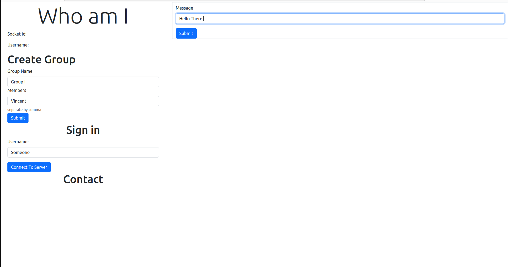

# Chat App


This project was built with react and flask. The app support multiple users all concurrently. The backend does not store any logs or anything. 
This project was just for me to learn about websocket and interesting techonologies. 

## Frontend 

This is built with react.js and socketio. For the styling, I used bootstrap. You could that everything are aligned.

## Backend 

This backend was built using Flask and Python. 

## how to run 

go into the frontend folder and do the following 

```
npm install
npm start
```

go into the backend folder and just run it like this 

```
pip3 install -r requirements.txt
python3 backend/server.py
```
